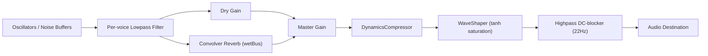

# Procedural Web Audio Engine

Source: [`src/audio/SynthEngine.ts`](../src/audio/SynthEngine.ts), [`src/audio/Voices.ts`](../src/audio/Voices.ts)

Every sound in the game — bonds, breaks, bursts, launch swooshes, wall thuds, and an ambient drone — is synthesized on the fly from oscillators and noise buffers. There are no audio asset files. On mobile, key events also trigger native haptic feedback via `@capacitor/haptics`.

## Audio Graph (`SynthEngine.initAudio`)

`initAudio()` is idempotent and lazily constructs this graph on first call (resuming the context if it already exists but is suspended — required because browsers block `AudioContext` creation before a user gesture). It's called from nearly every UI interaction handler in `main.ts` for that reason. It also builds the shared white-noise buffer (`noiseBuf`, 0.2s) used by thuds and note "tick" transients, and starts the ambient drone.

## Musical Scale System

`buildScale(name)` maps a named scale's semitone steps onto two octaves rooted at 110Hz (A2). Available scales (`SCALES`): Minor Pentatonic (default, `[0,3,5,7,10]`), Major Pentatonic, Hirajoshi, Kumoi, Whole Tone. Selecting a scale in the tuning panel rebuilds `AudioStore.scale`, the 10-entry frequency table every voice indexes into.

## Voice Profiles (`Voices.ts`)

`playNote(rel, xNorm, kind, boost?)` synthesizes one event, where `rel` (0–1) selects a scale degree and `xNorm` (−1..1) pans it:

| Voice | Duration | Character |
| :--- | :--- | :--- |
| `BOND_VOICE` | 0.30s (+jitter) | Fast attack (4ms), high octave (`mul: 4`), layered with a bandpass-filtered noise "tick" transient |
| `BREAK_VOICE` | 0.42s (+jitter) | Deep, dual-partial harmonic tone, slow lowpass sweep |
| `BURST_VOICE` | 3.2s (+jitter) | Soft 350ms swell, heaviest reverb send (`dry: 0.3`) |

Each note builds a small per-voice graph (envelope gain → lowpass filter → dry/wet split) with two detuned oscillator pairs (a binaural-style `BEAT` Hz offset between them) panned left/right, cleans itself up via `onended` (disconnecting every node it created), and decrements `AudioStore.activeVoices`.

`playThud('swoosh', xNorm, force)` is the launch release (low-passed noise sweep 380→2600→500Hz plus a pitch-swept sine sub).

`playKnock(xNorm, force, relHitter, relStruck)` is the ball-on-ball knock between two unbonded balls, tuned to the current scale. Each ball rings its colour's note — the same scale degree as that colour's bond lock, one octave up — so a collision is a two-note chord in key with the locks and drone, the struck ball sounding 18 ms after the hitter. Each note is a tuned wooden bar: sine modes × 1 / 3 / 6 with staggered 90/50/28 ms exponential decays, over a ~12 ms band-passed noise click. Harder hits are louder and brighter, never higher, so they stay in key.

## Dynamic Voice Management & Load Control

To avoid clipping and CPU spikes when many collisions happen at once:
- **Voice cap**: `MAX_VOICES = 22` regular voices, +6 extra allowance for high-priority (`burst`) events; `MAX_THUDS = 10` concurrent thuds.
- **Load-based ducking**: `AudioStore.load`/`loadAt` track a decaying "how busy is the mixer" estimate; `loadAt_(now) = load * 0.35^(now - loadAt)`. Each new note's gain is scaled down (`duck`) as load rises, and notes are dropped outright if `duck < 0.1`.
- **Scheduling spread**: non-priority notes are nudged forward in time (`cursor`, spaced ≥25ms apart, capped growth with load) so a wall of simultaneous collisions doesn't produce a single deafening spike; priority (burst) events skip this queue and always play at `now + LOOKAHEAD`.

## Ambient Drone (`startDrone`)

Two sine oscillators at `110 ∓ BEAT/2` Hz (`BEAT = 5`), panned hard left/right, produce a binaural 5Hz beat. A slow 0.06Hz LFO modulates the drone's gain for a "breathing" effect. Drone level is user-controlled via the `drone` tuning knob (`AudioStore.drone`, applied through `applyDrone`).

## Haptics Bridge

`triggerHaptic(style)` wraps `@capacitor/haptics`' `Haptics.impact()` in a try/catch (a no-op on plain web, since the plugin gracefully falls back or the promise rejection is swallowed). `playNote` fires `light`/`medium`/`heavy` haptics for `bond`/`break`/`burst` events respectively, giving native mobile builds tactile feedback synchronized with the sound design.
