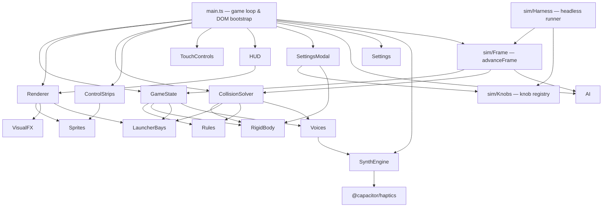

# Tone Boom — Technical & Architectural Documentation

## Executive Summary

**Tone Boom** is a physics-based arcade game that combines classic billiards mechanics with emergent color-bonding chemistry, rigid-body cluster dynamics, ghost chain reactions, procedural Web Audio synthesis, and dynamic fluid graphics.

The project was originally a zero-dependency single HTML file. It has since been rewritten into a modular **TypeScript** application built with **Vite**, tested with **Vitest**, and packaged for iOS and Android via **Capacitor**. There are no game-logic runtime dependencies — physics, audio synthesis, and rendering are all still hand-written against Canvas 2D and the Web Audio API; the only third-party runtime packages are the Capacitor plugin shims (haptics, status bar, screen orientation) used for the native app shells.

This document is the entry point into the docs set. Each major subsystem has its own detailed doc:

| Doc | Covers |
| :--- | :--- |
| [game-mechanics.md](./game-mechanics.md) | Gameplay rules, turn/match state machine, scoring, AI opponent |
| [scoring.md](./scoring.md) | Scoring deep-dive: credit attribution, how much score comes from chaotic consequences, measured proposals |
| [physics-engine.md](./physics-engine.md) | Rigid-body cluster physics, broadphase/narrowphase collision, launcher bays |
| [audio-engine.md](./audio-engine.md) | Procedural Web Audio synth graph, voices, load management, haptics |
| [rendering.md](./rendering.md) | Dual-canvas renderer, sprite caching, liquid background effects |
| [ui-controls.md](./ui-controls.md) | Control strips, touch aiming, HUD, tuning-panel knob reference |
| [tutorial.md](./tutorial.md) | Tutorial design (not yet implemented): steps, access from the menu, first-time tips |
| [mobile-capacitor.md](./mobile-capacitor.md) | Capacitor config, Android/iOS projects, native build & release flow |
| [simulation.md](./simulation.md) | Headless simulation harness: knob sweeps, invariants, physics checks, behaviour baselines |

---

## Project Layout

```
index.html            Single page shell — canvas, control strips, tuning panel, HUD
index.css             All styling (dark glassmorphic theme, control grids, responsive layout)
src/
  main.ts             App bootstrap, game loop (requestAnimationFrame), DOM wiring
  game/
    GameState.ts       Game struct, spawning, turns, match lifecycle, rain mechanic
    Rules.ts           Color palettes, special-ball draw logic, scoring constants
    AI.ts              Computer-opponent aim targeting
    Settings.ts        Settings-string serialization (share/export config)
  physics/
    Types.ts           Ball / Group / LauncherPlayer / Flash / Pop data shapes
    Config.ts          PhysicsConfig tunables + derived thresholds
    RigidBody.ts        Group construction, spin/inertia, wall clamping, separation
    CollisionSolver.ts  Broadphase grid, narrowphase impulses, bonding/bursting, relax pass
    LauncherBays.ts     Launcher aim math, throw speed, launcher-bay collision
  audio/
    SynthEngine.ts      Web Audio graph, AudioStore, drone, haptics bridge
    Voices.ts           Procedural note/thud synthesis (bond/break/burst voices)
  graphics/
    Renderer.ts         Foreground canvas draw pass (balls, bonds, launchers, HUD text)
    Sprites.ts          Cached ball/glow sprites, WCAG-based ink/label contrast
    VisualFX.ts         Offscreen low-res liquid background + flash ripples
  ui/
    ControlStrips.ts    Per-player angle/power sliders + draggable aim/power strips
    TouchControls.ts    Canvas pointer/touch aiming
    HUD.ts              Live ball/group counters, match-over scorecards
    SettingsModal.ts     Tuning panel knob wiring (binds DOM to the knob registry)
  sim/
    Frame.ts            advanceFrame — the single game loop, shared by main.ts and the harness
    Harness.ts          runSim/runMany: headless matches, aim policies, metric extractors
    Knobs.ts            Knob registry shared with the tuning panel; config snapshot/restore
    Metrics.ts          Geometric invariants, tolerances, per-frame sampling
    Stats.ts            Mean/standard error, noise-aware verdicts, paired catch-up
    Scenarios.ts        Hand-built fields that isolate the collision solver
    PhysicsChecks.ts    Textbook solver assertions (momentum, energy, rigidity)
    Baseline.ts         Scenario list, metric digest, behaviour diffing
    Rng.ts              Seeded Math.random for reproducible runs
scripts/
  sim.ts               Simulation CLI (npm run sim -- <command>)
tests/                 Vitest unit tests, mirroring the src/ tree
android/, ios/         Native Capacitor projects generated by `cap add`
capacitor.config.json  Capacitor app id, splash/status-bar config
vite.config.ts, tsconfig.json, vitest.config.ts
```

`node_modules/`, `dist/` (Vite build output), `android/`, and `ios/` are build artifacts/generated native projects rather than hand-authored source.

---

## Architecture Overview



### Core Systems Summary

1. **Game Loop (`main.ts`)** — Drives everything from a single `requestAnimationFrame` callback: adaptive `dt`, velocity-based physics sub-stepping (2–8 substeps per frame), turn timers, match countdown, AI aiming, and the "ball rain" idle-density mechanic.
2. **Rigid-Body Physics (`physics/`)** — Bonded balls form a single rigid `Group` with a shared center of mass, angular velocity, and moment of inertia. Collisions are impulse-based (linear + angular) with a uniform spatial grid for broadphase and an iterative position-relaxation pass to remove residual overlap.
3. **Game & Rules (`game/`)** — Owns the `Game` struct (balls, groups, players, match/turn state), color-bonding and special-ball rules, scoring, and a lightweight rule-based AI opponent.
4. **Procedural Audio (`audio/`)** — Synthesizes every sound (bonds, breaks, bursts, launch swooshes, wall thuds, a binaural ambient drone) from oscillators/noise buffers with load-based voice ducking, and triggers native haptic feedback via Capacitor on mobile.
5. **Rendering (`graphics/`)** — A high-DPI foreground canvas for balls/bonds/launchers/HUD text, backed by a low-resolution offscreen canvas that's scaled up to produce a soft "liquid" glow background; sprites are pre-rendered and cached to avoid per-frame gradient allocation.
6. **UI (`ui/`)** — Two mirrored control strips (angle/power sliders + draggable touch areas + ball-deck preview chips) for the two players, direct canvas-drag aiming, a live HUD, and a tuning panel that hot-patches `PhysicsConfig`/`AudioStore` values.
7. **Simulation (`sim/`)** — The game loop itself lives here as `advanceFrame`, called by both `main.ts` (which then draws) and the headless harness (which then measures), so there is only ever one simulation. Around it sit a seeded RNG, the shared knob registry, invariant checks, textbook physics assertions and a behaviour baseline. See [simulation.md](./simulation.md).
8. **Mobile Packaging (Capacitor)** — The Vite build output (`dist/`) is wrapped by Capacitor into native Android (`android/`) and iOS (`ios/`) projects; native plugins in use are Haptics, StatusBar, ScreenOrientation.

---

## Build & Tooling

| Command | Purpose |
| :--- | :--- |
| `npm run dev` | Vite dev server (port 3000) |
| `npm run build` | Type-check (`tsc --noEmit`) then bundle to `dist/` with sourcemaps |
| `npm run preview` | Serve the production build locally |
| `npm test` / `npm run test:watch` | Run the Vitest suite once / in watch mode |
| `npm run verify` | Full gate: type-check, tests, and all three simulation gates |
| `npm run sim -- <cmd>` | Simulation CLI: `run`, `sweep`, `compare`, `invariants`, `physics`, `baseline`, `knobs`, `metrics` |
| `npm run sim:physics` | Textbook collision-solver results (momentum, energy, 90° separation) |
| `npm run sim:invariants` | Geometric invariants on every frame of ten scenarios |
| `npm run sim:baseline` | Whether a change altered how the game plays |
| `npm run cap:sync` | Copy the web build into the native Android/iOS projects |
| `npm run cap:android` / `npm run cap:ios` | Open the native projects in Android Studio / Xcode |

TypeScript is configured in strict mode (`tsconfig.json`) targeting ES2020 with bundler module resolution; there is no emit step from `tsc` itself (`noEmit: true`) — Vite (esbuild) does the actual transpilation/bundling.

## Testing

The `tests/` tree mirrors `src/` and is run with Vitest against a `node` environment (see `vitest.config.ts`). Coverage spans:

- **Physics**: `RigidBody`, `CollisionSolver`, `LauncherBays`, `Config` — group construction, impulse math, bay clamping, threshold recalculation.
- **Game**: `GameState`, `Rules`, `AI` — spawning/fit checks, turn/match flow, special-ball draw odds, AI targeting.
- **Audio**: `SynthEngine`, `Voices` — audio-state defaults and voice-triggering guards (no real `AudioContext` in Node, so these test state/guard logic rather than actual DSP output).
- **Graphics**: `Renderer` — draw-pass behavior against a mocked canvas context.
- **Regression**: `tests/game/BugDetections.test.ts` — a running list of specific defect repros (e.g. special-ball color corruption on palette-size change, `drawFor` called with a player not in the roster, exploding an empty group) kept as permanent regression guards rather than being folded into the feature-oriented suites above.
- **Simulation**: `tests/sim/` — determinism and config isolation of the harness, the frame-delta guards, the textbook physics assertions, the invariants across modes and field sizes, the statistics helpers, and a check that the knob registry still agrees with the slider attributes in `index.html`.

Balance and behaviour questions are answered by the simulation harness rather than the unit suite: `npm run verify` runs the type-check, the tests and the three simulation gates together. See [simulation.md](./simulation.md).

---

## Summary Table of Key Source Files

| File | Responsibility |
| :--- | :--- |
| [`src/main.ts`](../src/main.ts) | Bootstrap, game loop, DOM event wiring |
| [`src/game/GameState.ts`](../src/game/GameState.ts) | Game struct, spawning, turns, match lifecycle |
| [`src/game/Rules.ts`](../src/game/Rules.ts) | Palettes, special-ball rules, scoring constants |
| [`src/game/AI.ts`](../src/game/AI.ts) | Computer opponent aim logic |
| [`src/game/Settings.ts`](../src/game/Settings.ts) | Settings-string export |
| [`src/physics/Types.ts`](../src/physics/Types.ts) | Core data shapes (Ball, Group, LauncherPlayer, …) |
| [`src/physics/Config.ts`](../src/physics/Config.ts) | Tunable physics constants + derived thresholds |
| [`src/physics/RigidBody.ts`](../src/physics/RigidBody.ts) | Cluster grouping, inertia, wall clamp, separation |
| [`src/physics/CollisionSolver.ts`](../src/physics/CollisionSolver.ts) | Broadphase/narrowphase collision, bonding/bursting, relax, `stepPhysics` |
| [`src/physics/LauncherBays.ts`](../src/physics/LauncherBays.ts) | Launcher aim/throw math, bay collision |
| [`src/audio/SynthEngine.ts`](../src/audio/SynthEngine.ts) | Web Audio graph, `AudioStore`, drone, haptics |
| [`src/audio/Voices.ts`](../src/audio/Voices.ts) | Procedural note/thud voice synthesis |
| [`src/graphics/Renderer.ts`](../src/graphics/Renderer.ts) | Foreground draw pass |
| [`src/graphics/Sprites.ts`](../src/graphics/Sprites.ts) | Cached sprites, contrast-aware label ink |
| [`src/graphics/VisualFX.ts`](../src/graphics/VisualFX.ts) | Liquid background + flash ripples |
| [`src/ui/ControlStrips.ts`](../src/ui/ControlStrips.ts) | Player angle/power sliders + drag areas |
| [`src/ui/TouchControls.ts`](../src/ui/TouchControls.ts) | Canvas pointer aiming |
| [`src/ui/HUD.ts`](../src/ui/HUD.ts) | Live counters + match-over scorecards |
| [`src/ui/SettingsModal.ts`](../src/ui/SettingsModal.ts) | Binds tuning-panel DOM inputs to the knob registry |
| [`src/sim/Frame.ts`](../src/sim/Frame.ts) | `advanceFrame` — the one game loop, shared by the browser and the harness |
| [`src/sim/Harness.ts`](../src/sim/Harness.ts) | Headless match runner and metrics |
| [`src/sim/Knobs.ts`](../src/sim/Knobs.ts) | Knob registry shared with the tuning panel |
| [`scripts/sim.ts`](../scripts/sim.ts) | Simulation CLI |
| `index.html` / `index.css` | Page markup and styling |
| `capacitor.config.json`, `android/`, `ios/` | Native app packaging |
